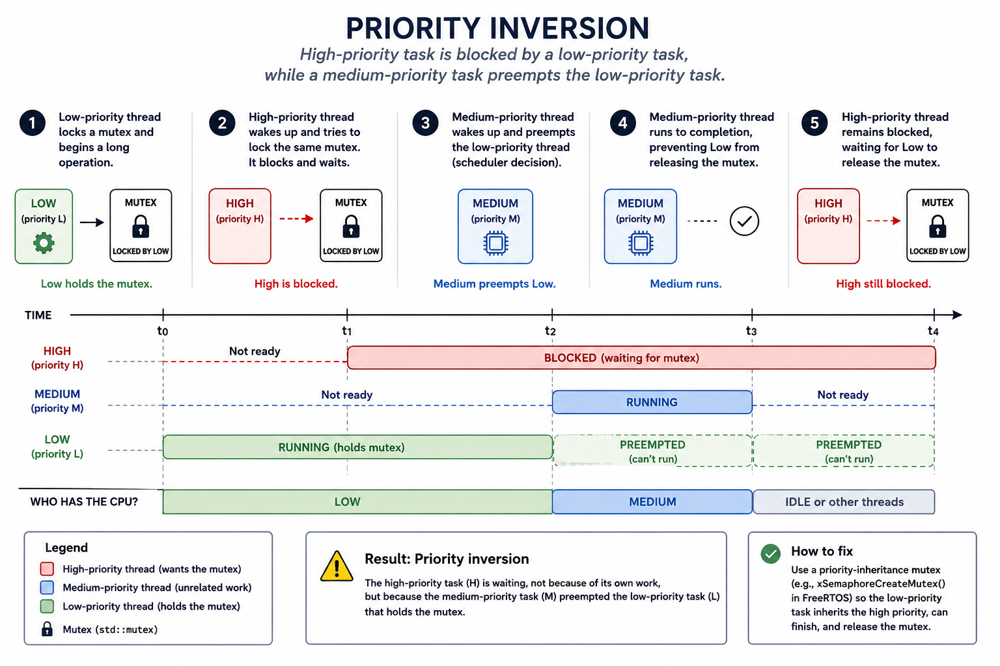

# Appendix A

## Multithreading and Synchronization in C++
This appendix introduces the fundamentals of concurrency in C++, and extends into more advanced topics useful for embedded systems with multiple cores or an RTOS:
* `std::thread`: Threads for parallel execution of code in C++.
* `std::mutex` combined with `std::lock_guard`: Protection of shared data (critical sections).
* `std::atomic`: How to share individual variables between threads without a mutex.
* The practical differences between atomic variables and mutexes.
* Scheduling: how the OS decides which thread runs and when.
* `std::future` and `std::async`: Higher-level asynchronous task launching.
* `std::condition_variable`: Efficient signalling between threads.
* Priority inversion: A subtle but dangerous bug in mixed-priority systems.

---

### Theory

#### 1. Concurrency vs. True Parallelism
Modern systems can execute multiple tasks simultaneously or appear to do so, depending on the hardware and OS. These two concepts are known as concurrency and parallelism:
* **Concurrency** means multiple tasks make progress over time; they may not run at exactly the same instant.  
* **Parallelism** means they genuinely run simultaneously.

The distinction becomes clear when looking at single-core vs. multi-core hardware:
* On a **single-core MCU** the scheduler interleaves threads one at a time (concurrency).
* On a **multi-core SoC** (e.g. ARM Cortex-A53 quad-core) threads truly run at the same time (parallelism).

`std::thread` works the same way in both cases; the hardware and OS decide.

---

#### 2. What Is a Thread?
A thread is an independent execution flow managed by the OS. Each thread has its own:
* **Program counter**: Tracks which instruction executes next.
* **Stack**: Holds local variables and return addresses for that thread's call chain.
* **Register state**: The CPU registers saved and restored on every context switch.

What threads share is everything else in the process; global variables, the heap, file handles, and any other objects explicitly passed between them. This is what makes shared-data bugs possible.

In C++, a thread is created using:

```cpp
std::thread t{function, argument};
```

**Note:** The `join()` method must be called to wait for a thread to finish before the program exits:

```cpp
std::thread t1{function1, argument1};
std::thread t2{function2, argument2};

t1.join();
t2.join();
```

Alternatively, `detach()` can be used to allow a thread to run independently of the other threads, but this is not recommended in the context of this course.

**Note:** Function `std::ref()` must be used when passing references to a thread, since `std::thread` copies its arguments by default:

```cpp
std::uint32_t counter{};
std::thread t1{function1, std::ref(counter)};
t1.join();
```

To pass a constant reference, use `std::cref()` instead:

```cpp
std::uint32_t counter{};
std::thread t2{function2, std::cref(counter)};
t2.join();
```

---

#### 3. Scheduling: Time-Slicing vs. Cooperative
The OS switches between threads in one of two ways:
* **Preemptive (time-slice):** The OS forcibly switches the running thread after a fixed time quantum (e.g. `1 ms`). The thread has no say; a timer interrupt triggers the context switch.
* **Cooperative:** A thread runs until it voluntarily yields. One badly-behaved thread can starve the rest.

You can hint at cooperative behaviour from C++ by invoking `std::this_thread::yield()` as shown below, but you cannot control the scheduler directly. Notably, `std::thread` provides no way to set thread priority. For that, you must use the platform's native thread handle via `std::thread::native_handle()` and call the platform API (e.g. `pthread_setschedparam()` on POSIX, `SetThreadPriority()` on Windows).

```cpp
#include <chrono>
#include <cstdint>
#include <thread>

void task() noexcept
{
    constexpr std::uint8_t sleep_ms{5U};

    // Run thread continuously.
    while (true)
    {
        // Do some work in this thread.
        doSomeWork();

        // Give hint to give up the CPU now (cooperative behaviour).
        std::this_thread::yield();

        // Sleep for at least 5 ms.
        std::this_thread::sleep_for(std::chrono::milliseconds(sleep_ms));
    }
}
```

Below is an example that demonstrates how you can set the priority and policy of a given thread `t1` in a Linux system:
* `native_handle()` returns a `pthread_t` on Linux, enabling access to the full POSIX thread API.
* `SCHED_FIFO` is a real-time scheduling policy; it requires elevated privileges on Linux (run with `sudo`).
* `t1` is assigned `SCHED_FIFO` with priority `100`, which is the highest valid POSIX real-time priority.

```cpp
int main()
{
    // Create thread running function task().
    std::thread t1{task};

    // Get the native handle of the thread (pthread in Linux).
    auto handle = t1.native_handle();

    // Set thread policy and priority via the handle.
    constexpr int maxPrio{100};
    sched_param sched{maxPrio};
    pthread_setschedparam(handle, SCHED_FIFO, &sched);

    t1.join();
    return 0;
}
```

---

#### 4. What Is a Data Race?
A data race occurs when:
* Two threads access the same memory location.
* At least one access is a write operation.
* No synchronization mechanism is used.

Result:
* Leads to undefined behavior, even if the program appears to work during testing.
* The program may work correctly until it suddenly does not.

---

#### 5. Mutexes and Critical Sections
A mutex is a lock that makes it easy to protect critical sections, i.e., regions containing resources shared between threads.

A mutex is implemented using the `std::mutex` type from the `<mutex>` header:

```cpp
std::mutex mutex{};
```

A mutex can be used to protect resources shared between threads:
* A given mutex is shared between the threads.
* Shared resources are protected by locking the mutex using `lock()`. This call blocks the current thread until the resource becomes available.
* Shared resources are made available to other threads by unlocking the mutex using `unlock()`.
* A mutex can protect multiple related variables simultaneously.

The example below demonstrates how a mutex is shared between two functions running in separate threads. Each thread temporarily gains exclusive access to the shared resources:
* The threads take turns using `std::cout` for terminal output.
* A mutex is used to protect `std::cout` in each thread:
    * A thread reserves `std::cout` as soon as it becomes available by locking the mutex.
    * While `std::cout` is reserved, other threads must wait.
    * Once access is granted, the thread performs its output operation.
    * After the output is complete, the mutex is unlocked to make `std::cout` available to the other thread.

**Note:** These examples intentionally omit a stop mechanism and are used for illustration purposes only.

```cpp
std::mutex mutex{};

// Function running in thread 1.
void thread1Func()
{
    while (true)
    {
        // Lock mutex before entering critical region.
        mutex.lock();
        {
            // Critical region - Feel free to access shared resources here.
            // Note: Terminal print is a resource shared between the threads.
            std::cout << "Thread1 currently has access to the terminal!\n";
        }
        // Unlock the mutex to make shared data available for the other thread.
        mutex.unlock();
    }
}

// Function running in thread 2.
void thread2Func()
{
    while (true)
    {
        // Lock mutex before entering critical region.
        mutex.lock();
        {
            // Critical region - Feel free to access shared resources here.
            // Note: Terminal print is a resource shared between the threads.
            std::cout << "Thread2 currently has access to the terminal!\n";
        }
        // Unlock the mutex to make shared data available for other threads.
        mutex.unlock();
    }
}
```

We can also use `std::lock_guard<T>` from `<mutex>` to automatically lock and unlock a mutex:

```cpp
std::lock_guard<std::mutex> lock{mutex};
```

This works as follows:
* The mutex is automatically locked when the lock guard is created.
* The mutex is automatically unlocked when the lock guard is destroyed, i.e., when it goes out of scope.

The code snippet above can be modified to use a lock guard, as shown below:

```cpp
std::mutex mutex{};

// Function running in thread 1.
void thread1Func()
{
    while (true)
    {
        {
            // Lock mutex before entering critical region.
            std::lock_guard<std::mutex> lock{mutex};

            // Critical region - Feel free to access shared resources here.
            // Note: Terminal print is a resource shared between the threads.
            std::cout << "Thread1 currently has access to the terminal!\n";
        }
    }
}

// Function running in thread 2.
void thread2Func()
{
    while (true)
    {
        {
            // Lock mutex before entering critical region.
            std::lock_guard<std::mutex> lock{mutex};

            // Critical region - Feel free to access shared resources here.
            // Note: Terminal print is a resource shared between the threads.
            std::cout << "Thread2 currently has access to the terminal!\n";
        }
    }
}
```

---

#### 6. `std::atomic`
Individual variables shared between threads, such as stop flags, can be made atomic instead of being protected by a mutex. This simplifies the implementation because no mutex needs to be created, locked, or unlocked:
* Atomic variables are implemented using the `std::atomic` type from the `<atomic>` header.
* For example, an atomic boolean variable named `stopFlag` can be implemented as:

```cpp
std::atomic<bool> stopFlag{false};
```

To modify and read the stop flag, the methods `store()` and `load()` can be used:

```cpp
// Set the stop flag.
stopFlag.store(true);

// Check the stop flag.
const bool stop{stopFlag.load()};
```

Atomic stop flags are commonly used to stop multiple threads simultaneously.

> Prefer `std::atomic` over a `volatile` variable; `volatile` gives no thread-safety guarantees in C++.

**Note:**
* An atomic variable only protects a single variable.
* If multiple variables must be updated together, a mutex is required, even if each individual variable is atomic.
* A mutex also provides memory synchronization between threads, ensuring that writes performed within a critical section become visible to other threads once the lock is released.

---

### Example: Mutex with Lock Guard and Atomic Stop Flag
The example below demonstrates a typical embedded scenario:
* A transmitter thread (TX) periodically produces messages.
* A receiver thread (RX) reads and consumes new data.
* A third thread stops program execution after a specified timeout.

```cpp
#include <atomic>
#include <chrono>
#include <cstdint>
#include <iostream>
#include <mutex>
#include <thread>

namespace
{
/**
 * @brief Shared memory used by TX and RX threads.
 *
 *        Access must be protected by mutex to avoid data races.
 */
struct SharedMem
{
    /** Shared data. */
    std::uint16_t data{};

    /** Indicate that new data is available (protected by a mutex, hence not atomic). */
    bool newData{false};
};

/** Mutex to protect critical regions. */
std::mutex mutex{};

// -----------------------------------------------------------------------------
void wait_ms(const std::size_t ms) noexcept
{
    // Sleep the calling thread for the given duration.
    std::this_thread::sleep_for(std::chrono::milliseconds(ms));
}

// -----------------------------------------------------------------------------
void txThread(SharedMem& shared, const std::atomic<bool>& stop,
              const std::size_t txInterval_ms) noexcept
{
    std::uint16_t counter{};

    // Run the TX loop as long as the stop flag isn't set.
    while (!stop.load())
    {
        // Enter critical section, lock the mutex to protect shared memory.
        {
            std::lock_guard<std::mutex> lock{mutex};

            // Produce new data and mark it as available.
            shared.data    = counter++;
            shared.newData = true;
            std::cout << "TX: Produced " << shared.data << "!\n";
        }
        wait_ms(txInterval_ms);
    }
}

// -----------------------------------------------------------------------------
void rxThread(SharedMem& shared, const std::atomic<bool>& stop,
              const std::size_t rxInterval_ms) noexcept
{
    // Run the RX loop as long as the stop flag isn't set.
    while (!stop.load())
    {
        // Enter critical section, lock the mutex to protect shared memory.
        {
            std::lock_guard<std::mutex> lock{mutex};

            // Consume new data if available.
            if (shared.newData)
            {
                std::cout << "RX: Consumed " << shared.data << "!\n";
                shared.newData = false;
            }
        }
        wait_ms(rxInterval_ms);
    }
}

// -----------------------------------------------------------------------------
void stopThread(std::atomic<bool>& stop, const std::size_t timeout_ms) noexcept
{
    // Wait for timeout, then signal all threads to stop.
    wait_ms(timeout_ms);
    stop.store(true);
}
} // namespace

// -----------------------------------------------------------------------------
int main()
{
    constexpr std::size_t txInterval_ms{1000U};
    constexpr std::size_t rxInterval_ms{100U};
    constexpr std::size_t threadTimeout_ms{10000U};

    // Shared memory structure.
    SharedMem sharedMem{};

    // Atomic stop flag shared between threads.
    // Atomic is sufficient here, since it protects a single variable.
    std::atomic<bool> stopFlag{false};

    // Create and run threads during ten seconds to simulate communication.
    std::thread t1{txThread, std::ref(sharedMem), std::cref(stopFlag), txInterval_ms};
    std::thread t2{rxThread, std::ref(sharedMem), std::cref(stopFlag), rxInterval_ms};
    std::thread t3{stopThread, std::ref(stopFlag), threadTimeout_ms};

    // Synchronize the threads.
    t1.join();
    t2.join();
    t3.join();
    return 0;
}
```

---

### Why Is a Mutex Needed?
`SharedMem` contains resources shared between the TX and RX threads that belong together:
* `data`: Data shared between the threads.
* `newData`: Indicates that new data is available.

If TX and RX execute simultaneously without a mutex, RX may read the data while it is being updated.  
A mutex ensures that both fields are updated completely before another thread is allowed to read them.

---

#### 7. `std::future` and `std::async`
A `std::future` represents the result of an asynchronous operation, i.e., the return value from a task running in another thread. `std::async` is the simplest way to launch such a task; it returns a `std::future` bound to its result. No manual thread management is needed, making it convenient for one-shot background computations.

`std::async` accepts an optional launch policy as its first argument:
* `std::launch::async`: The task runs immediately in a new thread.
* `std::launch::deferred`: The task is postponed and runs synchronously on the calling thread the first time `future.get()` or `future.wait()` is called. No new thread is created.

If no policy is specified, the implementation is free to choose either, which can lead to surprising behaviour. Prefer being explicit:

```cpp
// Always run in a new thread.
auto future = std::async(std::launch::async, computeChecksum, frame, headerLen);

// Run on the calling thread when future.get() is called.
auto future = std::async(std::launch::deferred, computeChecksum, frame, headerLen);
```

Below is an example of a checksum computation of a frame being performed while printing the frame content:

```cpp
#include <cstddef>
#include <cstdint>
#include <cstdio>
#include <future>

namespace
{
// -----------------------------------------------------------------------------
std::uint16_t computeChecksum(const std::uint8_t* buf, const std::size_t bufLen) noexcept
{
    // Check buffer, return 0 if invalid.
    if ((nullptr == buf) || (0U == bufLen)) { return 0U; }
    std::uint16_t chk{};

    // Compute the checksum by adding each byte of the buffer.
    for (std::size_t i{}; i < bufLen; ++i)
    {
        chk += buf[i];
    }
    return chk;
}

// -----------------------------------------------------------------------------
void printBuf(const std::uint8_t* buf, const std::size_t bufLen) noexcept
{
    if ((nullptr == buf) || (0U == bufLen)) { return; }
    std::printf("--------------------------------------------------------------------------------\n");
    for (std::size_t i{}; i < bufLen; ++i) { std::printf("0x%02X ", buf[i]); }
    std::printf("\n--------------------------------------------------------------------------------\n\n");
}
} // namespace

// -----------------------------------------------------------------------------
int main()
{
    constexpr std::size_t headerLen{8U};
    constexpr std::size_t chkLen{2U};
    constexpr std::size_t frameLen{headerLen + chkLen};
    constexpr std::size_t chkOffset1{frameLen - 2U};
    constexpr std::size_t chkOffset2{frameLen - 1U};
    constexpr std::size_t shift{8U};

    // Create a frame without checksum.
    std::uint8_t frame[frameLen]{0xA5U, 0xF7U, 0x00U, 0x02U, 0x25U, 0x01U, 0xFAU, 0xABU};

    // Compute the checksum asynchronously; print the frame during the computation.
    auto future = std::async(std::launch::async, computeChecksum, frame, headerLen);
    printBuf(frame, headerLen);

    // Add the checksum to the frame, then print the frame again.
    const auto chk = future.get();
    frame[chkOffset1] = static_cast<std::uint8_t>(chk >> shift);
    frame[chkOffset2] = static_cast<std::uint8_t>(chk);
    printBuf(frame, frameLen);
    return 0;
}
```

---

#### 8. `std::condition_variable`: Signalling Between Threads
A condition variable lets a thread sleep until another signals it; no busy-waiting or polling required: 
* Condition variables are appropriate when one thread produces data and another consumes it.
* In C++, a conditional variable is implemented as shown below:

```cpp
#include <condition_variable>

std::condition_variable condition{};
```

The example below demonstrates a typical embedded scenario:
* A transmitter thread (TX) periodically produces data and pushes it onto a shared queue.
* A receiver thread (RX) waits for new data using a condition variable and pops it from the queue.
* A third thread stops program execution after a specified timeout by setting a stop flag and notifying all waiting threads.

```cpp
#include <atomic>
#include <chrono>
#include <condition_variable>
#include <cstdint>
#include <cstdio>
#include <mutex>
#include <thread>
#include <queue>

namespace
{
/**
 * @brief Shared data structure.
 */
struct Shared
{
    /** Mutex to protect access to queue. */
    std::mutex mutex{};

    /** Stop flag to signal all threads to terminate. */
    std::atomic<bool> stop{false};

    /** Condition variable to notify rxThread when new data is available. */
    std::condition_variable condition{};

    /** Queue of data shared between txThread and rxThread. */
    std::queue<std::uint32_t> queue{};
};

// -----------------------------------------------------------------------------
bool isDataAvailable(const Shared& shared) noexcept
{
    // Return true if data is available or the stop flag is set.
    return !shared.queue.empty() || shared.stop.load();
}

// -----------------------------------------------------------------------------
void stopThread(Shared& shared, const std::uint16_t duration_ms) noexcept
{
    // Wait for the given duration to pass before setting the stop flag.
    std::this_thread::sleep_for(std::chrono::milliseconds(duration_ms));

    // Set stop flag and wake up all threads for clean termination.
    shared.stop.store(true);
    shared.condition.notify_all();
}

// -----------------------------------------------------------------------------
void txThread(Shared& shared) noexcept
{
    constexpr std::uint8_t period_ms{100U};
    std::uint32_t counter{};

    // Run thread as long as the stop flag is not set.
    while (!shared.stop.load())
    {
        // Enter critical section, lock the mutex to protect shared memory.
        {
            // Add number to queue.
            std::lock_guard<std::mutex> lock{shared.mutex};
            shared.queue.push(counter);
            std::printf("Pushed number %u to shared queue!\n", counter++);
        }
        // Notify the RX thread that data is available.
        shared.condition.notify_one();
        std::this_thread::sleep_for(std::chrono::milliseconds(period_ms));
    }
}

// -----------------------------------------------------------------------------
void rxThread(Shared& shared) noexcept
{
    // Run thread as long as the stop flag is not set.
    while (!shared.stop.load())
    {
        // Enter critical section, lock the mutex to protect shared memory.
        {
            // Wait for data to be available.
            std::unique_lock<std::mutex> lock{shared.mutex};
            auto predicate = [&shared] { return isDataAvailable(shared); };
            shared.condition.wait(lock, predicate);

            // Check if stop flag was set during the wait, terminate thread if true.
            if (shared.stop.load()) { break; }

            // Pop value from the queue when available.
            if (!shared.queue.empty())
            {
                const auto num = shared.queue.front();
                shared.queue.pop();
                std::printf("Popped number %u from shared queue!\n", num);
            }
        }
    }
}
} // namespace

// -----------------------------------------------------------------------------
int main()
{
    constexpr std::uint16_t duration_ms{2000U};

    // Create shared data structure.
    Shared shared{};

    // Create threads.
    std::thread t1{stopThread, std::ref(shared), duration_ms};
    std::thread t2{txThread, std::ref(shared)};
    std::thread t3{rxThread, std::ref(shared)};

    // Synchronize threads.
    t1.join();
    t2.join();
    t3.join();
    return 0;
}
```

**Notes:**
* `std::unique_lock` is used here instead of `std::lock_guard` because `condition.wait()` needs to temporarily release the mutex while the thread is sleeping.
* A lambda is used to wrap `isDataAvailable` together with the `shared` state it depends on, since `condition.wait()` requires a predicate callable with no arguments. The lambda captures `shared` by reference (`[&shared]`), so it can pass it into `isDataAvailable(shared)` each time `wait()` re-checks the condition, without copying the `Shared` struct (which wouldn't even compile, since it contains a non-copyable `std::atomic`).
* If `stopThread` only set `stop = true` without calling `notify_all()`, the RX thread could get stuck indefinitely inside `condition.wait()`: once `stop` is set, TX exits its loop and stops pushing values to the queue and calling `notify_one()`, so nothing would wake the RX thread up. Calling `notify_all()` ensures any thread sleeping in `wait()` is woken up. The `|| shared.stop.load()` clause in `isDataAvailable` then makes the predicate return `true`, allowing `wait()` to return so the thread can detect the stop flag and exit cleanly.

You can also invoke non-static member functions as thread entry points, rather than passing the shared struct by reference into free functions, as shown below:

```cpp
#include <atomic>
#include <chrono>
#include <condition_variable>
#include <cstdint>
#include <cstdio>
#include <mutex>
#include <thread>
#include <queue>

namespace
{
/**
 * @brief Shared data structure.
 */
struct Shared
{
    /** Mutex to protect access to queue. */
    std::mutex mutex{};

    /** Stop flag to signal all threads to terminate. */
    std::atomic<bool> stop{false};

    /** Condition variable to notify rxThread when new data is available. */
    std::condition_variable condition{};

    /** Queue of data shared between txThread and rxThread. */
    std::queue<std::uint32_t> queue{};

    // -----------------------------------------------------------------------------
    void stopThread(const std::uint16_t duration_ms) noexcept
    {
        // Wait for the given duration to pass before setting the stop flag.
        std::this_thread::sleep_for(std::chrono::milliseconds(duration_ms));

        // Set stop flag and wake up all threads for clean termination.
        stop.store(true);
        condition.notify_all();
    }

    // -----------------------------------------------------------------------------
    void txThread() noexcept
    {
        constexpr std::uint8_t period_ms{100U};
        std::uint32_t counter{};

        // Run thread as long as the stop flag is not set.
        while (!stop.load())
        {
            // Enter critical section, lock the mutex to protect shared memory.
            {
                // Add number to queue.
                std::lock_guard<std::mutex> lock{mutex};
                queue.push(counter);
                std::printf("Pushed number %u to shared queue!\n", counter++);
            }
            // Notify the RX thread that data is available.
            condition.notify_one();
            std::this_thread::sleep_for(std::chrono::milliseconds(period_ms));
        }
    }

    // -----------------------------------------------------------------------------
    void rxThread() noexcept
    {
        // Run thread as long as the stop flag is not set.
        while (!stop.load())
        {
            // Enter critical section, lock the mutex to protect shared memory.
            {
                // Wait for data to be available.
                std::unique_lock<std::mutex> lock{mutex};
                auto predicate = [this] { return isDataAvailable(); };
                condition.wait(lock, predicate);

                // Check if stop flag was set during the wait, terminate thread if true.
                if (stop.load()) { break; }

                // Pop value from the queue when available.
                if (!queue.empty())
                {
                    const auto num = queue.front();
                    queue.pop();
                    std::printf("Popped number %u from shared queue!\n", num);
                }
            }
        }
    }

private:
    // -----------------------------------------------------------------------------
    bool isDataAvailable() noexcept
    {
        // Return true if data is available or the stop flag is set.
        return !queue.empty() || stop.load();
    }

};
} // namespace

// -----------------------------------------------------------------------------
int main()
{
    constexpr std::uint16_t duration_ms{2000U};

    // Create shared data structure.
    Shared shared{};

    // Create threads.
    std::thread t1{&Shared::stopThread, &shared, duration_ms};
    std::thread t2{&Shared::txThread, &shared};
    std::thread t3{&Shared::rxThread, &shared};

    // Synchronize threads.
    t1.join();
    t2.join();
    t3.join();
    return 0;
}
```

**Notes:**
* Since `isDataAvailable` and the thread functions now live inside `Shared`, they have implicit access to all of `Shared`'s members through `this`. The lambda therefore captures `[this]` instead of `[&shared]`, giving it access to the whole enclosing object rather than one external reference. This also means that it can reach `isDataAvailable()` even though it's `private`.
* The same stuck-wait concern applies here as in the free-function version above: `notify_all()` in `stopThread` is essential. Without it, the RX thread could remain blocked in `condition.wait()` indefinitely once TX stops pushing new values.

---

#### 9. Priority Inversion
Priority inversion is a scheduling bug that can occur when threads of different priorities share a mutex. Here is what happens, step by step:
1. A **low-priority thread** locks a mutex and begins a long operation.
2. A **high-priority thread** wakes up and tries to lock the same mutex. Since the mutex is locked by the low-priority thread, the high-priority thread blocks and waits.
3. A **medium-priority thread** wakes up and preempts (forcibly takes the CPU from) the low-priority thread, because it has higher priority. This thread does not use the mutex at all; it is doing its own completely unrelated work. The scheduler simply gives it the CPU because it outranks the currently running low-priority thread.
4. The medium-priority thread runs to completion, preventing the low-priority thread from finishing and releasing the mutex.
5. The high-priority thread remains blocked, not because of its own work, but because the medium-priority thread delayed the lock release.

The high-priority task ends up waiting on the medium-priority one; an inversion of the intended scheduling order.

Note that the preemption in step 3 is a normal scheduler decision:
* The OS sees a higher-priority thread become runnable and gives it the CPU. The mutex plays no role there. 
* The problem is that `std::mutex` has no way to prevent the inversion once it starts; it does not support **priority inheritance**, a feature where the mutex temporarily boosts the low-priority thread's priority (to match the blocked high-priority thread) so it can finish and release the lock before any medium-priority thread cuts in. On an RTOS, this can be addressed with a priority-inheritance mutex (see note below).

Priority inversion can be illustrated as shown below:


The following code shows a conceptual example of the same scenario:

```cpp
// Mutex used to protect access of shared resources.
std::mutex mutex{};

// -----------------------------------------------------------------------------
void lowPriorityTask() noexcept
{
    // Holds the mutex during a long operation, blocking highPriorityTask.
    std::lock_guard<std::mutex> lock{mutex};
    runLongOperation();
}

// -----------------------------------------------------------------------------
void mediumPriorityTask() noexcept
{
    // Preempts lowPriorityTask, preventing it from releasing the mutex.
    runCpuIntensiveWork();
}

// -----------------------------------------------------------------------------
void highPriorityTask() noexcept
{
    // Blocks until lowPriorityTask releases the mutex.
    std::lock_guard<std::mutex> lock{mutex};
    resetWatchdog();
}
```

> **Notes:** 
> * Priority inversion cannot be reliably demonstrated with standard C++ on a desktop OS. `std::thread` assigns no priority by default, so the scheduler treats all threads equally. The example above is a conceptual illustration only.
> * If you are mixing thread priorities on an RTOS, replace `std::mutex` with the platform's native priority-inheritance mutex. `std::thread` itself is not the problem.

---

### Rule of Thumb
* `std::atomic` is suitable for individual variables, such as stop flags.
* `std::mutex` is required when multiple resources, such as variables, are shared between threads.
* `std::condition_variable` replaces polling loops when a thread must wait for an event produced by another thread.
* `std::async` / `std::future` is convenient for one-shot background tasks where you need the result later.
* Be aware of **priority inversion** whenever threads of mixed priority share a mutex.

---

## Summary
In this appendix, we have seen:
* The difference between concurrency and true parallelism.
* How the scheduler decides which thread runs; time-slicing vs. cooperative.
* How to create threads using `std::thread`.
* How to protect shared data using `std::mutex`.
* How to use `std::atomic` correctly.
* The difference between atomic variables and mutexes.
* How to signal between threads efficiently using `std::condition_variable`.
* How to launch background tasks using `std::async` and `std::future`.
* What priority inversion is and why it matters in embedded systems.

These concepts form the foundation of safe parallel programming in modern C++.

---
